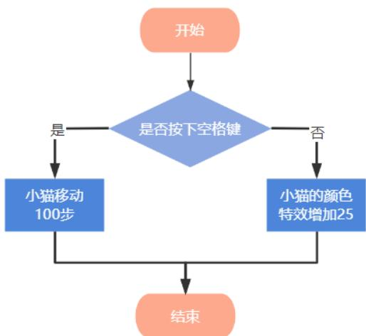

## GESP C++二级试卷

（满分：100分 考试时间：90分钟）

学校：

姓名：

<table><tr><td>题目</td><td>一</td><td>二</td><td>三</td><td>总分</td></tr><tr><td>得分</td><td></td><td></td><td></td><td></td></tr></table>

## 一、单选题（每题2 分，共 30分）

<table><tr><td>题号</td><td>1</td><td>2</td><td>3</td><td>4</td><td>5</td><td>6</td><td>7</td><td>8</td><td>9</td><td>10</td><td>11</td><td>12</td><td>13</td><td>14</td><td>15</td></tr><tr><td>答案</td><td>D</td><td>C</td><td>A</td><td>D</td><td>B</td><td>A</td><td>C</td><td>C</td><td>B</td><td>B</td><td>A</td><td>D</td><td>C</td><td>D</td><td>C</td></tr></table>

1. 以下存储器中的数据不会受到附近强磁场干扰的是（ ）。A．硬盘B．U 盘C．内存D．光盘

2. 下列流程图，属于计算机的哪种程序结构？（ ）。



A．顺序结构B．循环结构C．分支结构D．数据结构

3. 下列关于 C++语言的叙述，不正确的是（）。A．double 类型的变量占用内存的大小是浮动的B．bool 类型的变量占用 1字节内存C．int 类型变量的取值范围不是无限的D．char 类型的变量有 256 种取值

4. 下列关于 C++语言的叙述，不正确的是（）。A．变量定义后，可以使用赋值语句改变它的值B．变量定义时，必须指定类型C．变量名必须为合法标识符D．合法标识符可以以数字开始

5. 以下哪个不是 C++语言的关键字？

A．return B．max C．else D．case

6. 以下哪个不是C++语言的运算符？A．\=B．/=C．-=D．!=

7. 如果a和b都是 char类型的变量，下列哪个语句不符合 C++语法？A．b = a + 1;B．b = a + '1';C ${ \mathrm {  ~ b ~ } } = { \mathrm {  ~ \dot { ~ } a ~ } } ^ { \prime } + + ;$ D．b = a++;

8. 如果a、b、c和 d都是int类型的变量，则下列哪个表达式能够正确计算它们的平均值？A． (a + b + c + d) / 4B． (a + b + c + d) % 4C． (a + b + c + d) / 4.0D． (a + b + c + d) % 4.0

9. 如果a为char类型的变量，且 a的值为'2'，则下列哪条语句执行后，a的值不会变为'3'？

A．a = a + 1; B．a + 1; C ${ \mathrm { ~ a ~ } = \mathrm { ~ 1 ~ + ~ a ~ } ; }$ D．++a;

10.如果 a为int类型的变量，且 a的值为9，则执行a -= 3;之后，a的值会是（）。A．3B．6C．9D．12

11.如果 a和b均为 int类型的变量，下列表达式能正确判断“a等于 0或b等 于0”的是（） A．(!a) || (!b) B．(a == b == 0) C． (a == 0) && (b == 0) D．(a == 0) - (b == 0) == 0

12.如果 a为char类型的变量，下列哪个表达式可以正确判断“a是小写字母”？A．a <= a <= zB $\mathrm { ~ a ~ - ~ } \mathrm { ~ \ r ~ { ~ a ~ } ~ } ^ { \prime } \mathrm { ~ < = ~ } \mathrm { ~ \ r ~ { ~ z ~ } ~ } ^ { \prime } \mathrm { ~ - ~ } \mathrm { ~ \ r ~ { ~ a ~ } ~ } ^ { \prime }$ C $\mathrm { ~  ~ a ~ } ^ { , } ~ \langle = \mathrm { ~  ~ a ~ } \langle = \mathrm { ~  ~ \rho ~ } ^ { , } \mathrm { ~  ~ z ~ } ^ { , }$ D $\mathrm { ~ a ~ } ~ \rangle = \mathrm { ~ \ ' ~ a ~ } ^ { , } ~ \& \& ~ \mathrm { ~ a ~ } ~ \langle = \mathrm { ~ \ ' ~ z ~ } ^ { , }$

13.在下列代码的横线处填写（），使得输出是\`50 10\`。

```cpp
#include <iostream>
using namespace std;
int main() {
    int a = 10, b = 50;
    ____; // 在此处填入代码
    b -= a;
    a += b;
    cout << a << " " << b << endl;
    return 0;
}
A. a -= b
B. a += b
C. a = b - a
D. a = b
```

14.在下列代码的横线处填写（），可以使得输出是5。

```cpp
1 #include <iostream>
2 using namespace std;
3 ∨ int main() {
4    int cnt = 0;
5 ∨    for (char ch = '1'; ch <= '9'; ch++)
6 ∨    if (____) // 在此处填入代码
7    cnt++;
8    cout << cnt << endl;
9    return 0;
10 }
A. ch < '5'
B. ch >= 5
C. ch >= '4'
D. ch % 2 == 1
```

15.执行以下C++语言程序后，输出结果是（）。

```cpp
#include <iostream>
using namespace std;
int main() {
    int n = 17;
    bool isprime = true;
    for (int i = 2; i <= n; i++)
    if (n % i == 0)
    isprime = false;
    cout << isprime << endl;
    return 0;
}
```

C．0

D．1

## 二、判断题（每题2 分，共 20分）

<table><tr><td>题号</td><td>1</td><td>2</td><td>3</td><td>4</td><td>5</td><td>6</td><td>7</td><td>8</td><td>9</td><td>10</td></tr><tr><td>答案</td><td>×</td><td>×</td><td>√</td><td>×</td><td>×</td><td>×</td><td>×</td><td>√</td><td>√</td><td>√</td></tr></table>

1. 明明和笑笑在“小庙会”上分别抽到一个 4GB和4096MB的U盘，容量大的盘是笑笑的（ ）。

2. IPv4 的地址通常用“点分十进制”的表示形式，形如（a.b.c.d），其中a、b、c、d都是 1\~255之间的十进制整数（ ）。

3. 在C++语言中，一个程序不能有多个 main 函数。

4. 在C++语言中，标识符中可以有下划线\_，但不能以下划线\_开头。

5. 如果 a是int类型的变量，而且值为 1，则表达式'a'的值为'1'。

6. 在 if ... else 语句中，else 子句可以嵌套 if ... else 语句，但 if 子句不可以，因为会造成二义性。

7. while 语句的循环体至少会执行一次。

8. C++语言中>=是运算符，但=>不是。

9. 如果 a为char类型的变量，且取值为小写字母，则执行语句 a = a - 'a$+ \mathrm { ~  ~ \chi ~ } _ { \mathrm { { A } } } ^ { , }$ ;后，a的值会变为与原值对应的大写字母。

10.表达式(10.0 / 2)的计算结果为 5.0，且结果类型为 double。

## 三、编程题（每题25 分，共50分）

<table><tr><td>题号</td><td>1</td><td>2</td></tr><tr><td>答案</td><td></td><td></td></tr></table>

## 1. 画三角形

## 【问题描述】

输入一个正整数 n，请使用大写字母拼成一个这样的三角形图案（参考样例输入输出）：三角形图案的第 1 行有 1 个字母，第 2 行有 2 个字母，以此类推；在三角形图案中，由上至下、由左至右依次由大写字母 A-Z填充，每次使用大写字母Z填充后，将从头使用大写字母 A填充。

## 【输入描述】

输入一行，包含一个正整数 n。约定2≤n≤40。

## 【输出描述】

输出符合要求的三角形图案。注意每行三角形图案的右侧不要有多余的空格。

【样例输入 1】

3

【样例输出 1】

DEF

## 【参考程序】

```cpp
#include <iostream>
using namespace std;
int main() {
    int n;
    cin >> n;
    int ch = 0;
    for (int i = 1; i <= n; i++) {
    for (int j = 1; j <= i; j++)
    cout << (char)'A' + (ch++) % 26);
    cout << endl;
    }
    return 0;
}
```

## 2. 百鸡问题

## 【问题描述】

“百鸡问题”是出自我国古代《张丘建算经》的著名数学问题。大意为：“每只公鸡 5 元，每只母鸡 3 元，每 3 只小鸡 1元；现在有 100 元，买了 100 只鸡，共有多少种方案？”

小明很喜欢这个故事，他决定对这个问题进行扩展，并使用编程解决：如果每只公鸡x元，每只母鸡 y元，每z只小鸡 1元；现在有n元，买了 m只鸡，共有多少种方案？

## 【输入描述】

输入一行，包含五个整数，分别为问题描述中的 x、y、z、n、m。约定 1≤x, y, z ≤10，1≤ n, m ≤1000。

## 【输出描述】

输出一行，包含一个整数 C，表示有C种方案。

【样例输入 1】

5 3 3 100 100

【样例输出 1】

4

## 【样例解释1】

这就是问题描述中的“百鸡问题”。4种方案分别为：公鸡 0只、母鸡 25只、小鸡75 只；公鸡4 只、母鸡18只、小鸡78 只；公鸡8只、母鸡11 只、小鸡 81只；公鸡12只、母鸡 4只、小鸡84只。。

【样例输入2】

1 1 1 100 100

【样例输出2】

5151

【参考程序】

```cpp
#include <iostream>
using namespace std;
int main() {
    int x, y, z, n, m, cnt = 0;
    cin >> x >> y >> z >> n >> m;
```

```txt
for (int gj = 0; gj * x <= n && gj <= m; gj++)
    for (int mj = 0; mj * y + gj * x <= n && mj + gj <= m; mj++) {
    int xj = (n - gj * x - mj * y) * z;
    if (gj + mj + xj == m)
    cnt++;
}
cout << cnt << endl;
return 0;
```