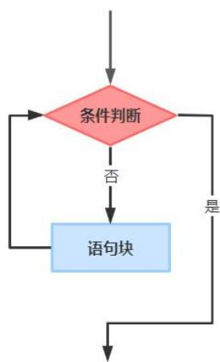

## GESP C++二级试卷

（满分：100 分 考试时间：90 分钟）

学校：

姓名：

<table><tr><td>题目</td><td>一</td><td>二</td><td>三</td><td>总分</td></tr><tr><td>得分</td><td></td><td></td><td></td><td></td></tr></table>

## 一、单选题（每题 2 分，共 30 分）

<table><tr><td>题号</td><td>1</td><td>2</td><td>3</td><td>4</td><td>5</td><td>6</td><td>7</td><td>8</td><td>9</td><td>10</td><td>11</td><td>12</td><td>13</td><td>14</td><td>15</td></tr><tr><td>答案</td><td>D</td><td>D</td><td>B</td><td>C</td><td>C</td><td>D</td><td>D</td><td>A</td><td>B</td><td>D</td><td>A</td><td>A</td><td>D</td><td>B</td><td>C</td></tr></table>

1. 高级语言编写的程序需要经过以下（ ）操作，可以生成在计算机上运行的可执行代码。A. 编辑B. 保存C. 调试D. 编译

2. 能够实现下面流程图功能的伪代码是（ ）。



A. if 条件判断 then 语句块B. if 条件判断 then 什么也不做 else 语句块C. while 条件判断 do 语句块D. while not 条件判断 do 语句块

3. 下列关于C++语言的叙述，正确的是（ ）。A. char 类型变量不能赋值给int 类型的变量。B. 两个int 类型变量相乘，计算结果还是int 类型。C. 计算两个int 类型变量相乘时，如果乘积超出了int 类型的取值范围，程序会报错崩溃。D. 计算两个double 类型变量相除时，如果除数的值为0.0，程序会报错崩溃。

4. 下列关于C++语言的叙述，不正确的是（ ）。A. if 语句中的判断条件必须用小括号‘(’和‘)’括起来。B.for 语句中两个‘;’之间的循环条件可以省略，表示循环继续执行的条件一直满足。C. 循环体包含多条语句时，可以用缩进消除二义性。D. 除了“先乘除、后加减”，还有很多运算符优先级。

5. 以下哪个是C++语言的关键字？（ ）A. mainB. maxC. doubleD. sqrt

6. 以下哪个不是C++语言的运算符？（ ）A. >=B. /=C. ||D. <>

7. 如果 a 为 int 类型的变量，b 为 char 类型的变量，则下列哪个语句不符合C++语法？（ ）A. $\textsf { a } = \textsf { a } + \textsf { 1 } . \textsf { \textsf { 0 } } ;$ ;B. $a ~ = ~ ( \operatorname { i n t } ) ( { \mathsf { b } } ~ - ~ { \mathsf { ^ { \prime } } } \theta ^ { \prime } )$ ;C. $b ~ = ~ ( \mathsf { c h a r } ) ( \mathsf { a } ~ + ~ ^ { \prime } \otimes ^ { \prime } )$ ;D. $( \mathtt { i n t } ) \mathtt { b } \ = \ \mathtt { a } ;$

8. 如果用两个int 类型的变量a 和b 分别表达平行四边形的两条边长，用int类型的变量 h 表达 a 边对应的高，则下列哪个表达式不能用来计算 b 边对应的高？（ ）A. $a ~ / ~ b ~ ^ { * } ~ ( \theta . \theta ~ + ~ h )$ B. $( \theta . \theta \ + \ \mathsf { a } \ ^ { \ * } \ \mathsf { h } ) \ / \ \mathsf { b }$ C. $\textsf { a } ^ { * } \textsf { h } / \textsf { ( b } + \theta . \theta )$

D. $( \textsf { a } + \textsf { \theta } . \theta ) * \textsf { h } / \textsf { b }$

9. 以下哪个循环语句会无限次执行？（ ）A. $\mathsf { f o r } \ \mathrm { ~ ( ~ i n t ~ \mathsf ~ { ~ a ~ } ~ = ~ } \theta ; \ \mathsf { a } ; \ \mathsf { a } + + \mathrm { ) ~ } \mathrm { ~ ; ~ }$ ;B. $\mathsf { f o r ~ ( b o o l ~ b ~ = ~ f a l s e ; ~ b ~ < = ~ t r u e ; ~ b + + ) }$ ;C. $\mathsf { f o r \alpha ( c h a r c \alpha = \beta ^ { \prime } A ^ { \prime } \cdot \alpha \mathsf { c } \cdot \beta ^ { \prime } \mathsf { \beta } \mathsf { \beta } ^ { \prime } c + \beta ^ { \prime } \mathsf { \beta } ) }$ ;D. $\mathsf { f o r ~ \mathsf { \Gamma } ( d o u b l e ~ d ~ = ~ } \theta . \theta ; \mathsf { \Gamma } \mathsf { d ~ < ~ } 1 \theta . \theta ; \mathsf { d ~ + = ~ } \theta . \theta \theta 1 \mathsf { \Gamma } )$ ;

10. 如果 a 为 char 类型的变量，且 a 的值为'C'（已知'C'的 ASCII 码为 67），则执行 cout << (a + 2);会输出（ ）。A. EB. C+2C. C2D. 69

11. 如果 a 和 b 均为 int 类型的变量，下列表达式能正确判断“a 等于 1 且 b等于1”的是（ ）。A. $( \mathsf { a } \ = \mathsf { b } ) \ \& \ \mathsf { 8 } \ ( \mathsf { b } \ = \mathsf { 1 } )$ B. (a && b)C. (a == b == 1)D. (a \* b == 1)

12. 如果a 为 char 类型的变量，下列哪个表达式可以正确判断“a 是数字”？（ ）A. $\theta ^ { \prime } \ < = \ \mathsf { a } \& \& \ \mathsf { a } \ \ < = \ \mathsf { \Omega } ^ { \prime } 9 ^ { \prime }$ B. $1 1 < \texttt { \small 4 } 8 8 \texttt { \small d } < = \texttt { \small 1 } _ { Q } ,$

```txt
C. '0' <= a <= '9'
D. '1' <= a <= '0'
```

13. 在下列代码的横线处填写（ ），使得输出是9。

```cpp
#include <iostream>
using namespace std;
int main() {
    char a = '3', b = '6';
    cout << ____; // 在此处填入代码
    return 0;
}
A. (a + b)
B. (a + b - '0')
C. (char)(a + b)
D. (char)(a + b - '0')
```

14. 在下列代码的横线处填写（ ），可以使得输出是42。

```cpp
#include <iostream>
using namespace std;
int main() {
    int sum = 0;
    for (int i = 1; i <= 20; i++)
    if (____) // 在此处填入代码
    sum += i;
    cout << sum << endl;
    return 0;
}
A. i % 3 == 0
B. 20 % i == 0
C. i <= 8
D. i >= 18
```

15. 执行以下C++语言程序后，输出结果是（ ）。

```cpp
#include <iostream>
using namespace std;
int main() {
    for (char x = 'A'; x <= 'D'; x++)
    if ((x != 'A') + (x == 'C') + (x == 'D') + (x != 'D') == 3)
    cout << x;
    return 0;
}
A. A
B. B
C. C
D. D
```

## 二、判断题（每题 2 分，共 20 分）

<table><tr><td>题号</td><td>1</td><td>2</td><td>3</td><td>4</td><td>5</td><td>6</td><td>7</td><td>8</td><td>9</td><td>10</td></tr><tr><td>答案</td><td>×</td><td>×</td><td>√</td><td>×</td><td>×</td><td>√</td><td>√</td><td>×</td><td>√</td><td>×</td></tr></table>

1. 诞生于1986年的中华学习机CEC-I入选了2021年的CCF计算机历史记忆（一类），它的内存只有64KB。当时的汉字编码字符集GB2312中共有6763个汉字，假如每个汉字用2个字节编码，将整个GB2312汉字字符集都放入CEC-I的内存，也只占用了不超过1/5的内存空间。

2. 域名是由一串用点分隔的名字来标识互联网上一个计算机或计算机组的名称，CCF 编程能力等级认证官方网站的域名是 gesp.ccf.org.cn，其中顶级域名是gesp。

3. 在使用C++语言编写程序时，不能使用sqrt、abs 等数学函数，包含<cmath>或<math.h>头文件后就能够使用了。

4. 在C++语言中，标识符中可以有下划线‘\_’。同时，‘\_’也是C++语言的运算符。

5. 如果a 是double 类型的变量，而且值为 3.5，则表达式a \* 10 的计算结果为35，且结果类型为 int。

6. 在if 语句中，如果条件成立时需要执行多条语句，可以使用大括号‘{’和}’将这些语句括起来。

7. 循环语句的循环体有可能无限制地执行下去。

8. ++和==都是C++语言的运算符，但+=不是。

9. 如果a 为char 类型的变量，且取值为大写字母'F'，则执行语句a = a + 1;后，a 的值会变为大写字母'G'。

10. 表达式sqrt(9.0)的计算结果为3，且结果类型为int。

## 三、编程题（每题 25 分，共 50 分）

<table><tr><td>题号</td><td>1</td><td>2</td></tr><tr><td>答案</td><td></td><td></td></tr></table>

## 1. 找素数

## 【问题描述】

小明刚刚学习了素数的概念：如果一个大于1的正整数，除了1和它自身外，不能被其他正整数整除，则这个正整数是素数。现在，小明想找到两个正整数和 之间（包括 和 ）有多少个素数？

## 【输入描述】

输入 2 行，第一行包含正整数 ，第二行包含正整数 。约定 $2 \leq A \leq B \leq$ 1000<sup>。</sup>

## 【输出描述】

输出一行，包含一个整数 ，表示找到 个素数。

## 【样例输入1】

```txt
2   
10
```

【样例输出1】

```txt
4
```

【样例解释1】

在2和10之间有4个素数，分别为：2、3、5、7。

【样例输入2】

```txt
98
100
```

【样例输出2】

```txt
θ
```

【参考程序】

```cpp
#include <iostream>
using namespace std;
int main() {
    int a = 0, b = 0, cnt = 0;
    cin >> a >> b;
    for (int n = a; n <= b; n++) {
    bool isPrime = true;
    for (int i = 2; i * i <= n; i++) {
    if (n % i == 0) {
    isPrime = false;
    break;
    }
    }
    if (isPrime)
    cnt++;
    }
    cout << cnt << endl;
    return 0;
}
```

## 2. 自幂数判断

## 【问题描述】

自幂数是指，一个 位数，满足各位数字 次方之和是本身。例如，153是3位数，其每位数的 3 次方之和， $1 ^ { 3 } + 5 ^ { 3 } + 3 ^ { 3 } = 1 5 3$ ，因此 153 是自幂数；1634是4位数，其每位数的 4次方之和， $1 ^ { 4 } + 6 ^ { 4 } + 3 ^ { 4 } + 4 ^ { 4 } = 1 6 3 4$ ，因此 1634 是自幂数。

现在，输入若干个正整数，请判断它们是否是自幂数。

## 【输入描述】

输入第一行是一个正整数 ，表示有 个待判断的正整数。约定 $1 \leq M \leq 1 0 0$ C

从第2行开始的 行，每行一个待判断的正整数。约定这些正整数均小于 8。

## 【输出描述】

输出 行，如果对应的待判断正整数为自幂数，则输出英文大写字母'T'，否则输出英文大写字母'F'。

提示：不需要等到所有输入结束在依次输出，可以输入一个数就判断一个数并输出，再输入下一个数。

【样例输入1】

<table><tr><td>3</td></tr><tr><td>152</td></tr><tr><td>111</td></tr><tr><td>153</td></tr></table>

【样例输出1】

<table><tr><td>F</td></tr><tr><td>F</td></tr><tr><td>T</td></tr></table>

【样例输入2】

<table><tr><td>5</td></tr><tr><td>8208</td></tr><tr><td>548834</td></tr><tr><td>88593477</td></tr><tr><td>12345</td></tr><tr><td>5432</td></tr></table>

【样例输出2】

<table><tr><td>T</td></tr><tr><td>T</td></tr><tr><td>T</td></tr><tr><td>F</td></tr><tr><td>F</td></tr></table>

【参考程序】

```cpp
#include <iostream>
using namespace std;
int main() {
    int m = 0;
    cin >> m;
    for (int i = 0; i < m; i++) {
    int n = 0;
    cin >> n;
    // 数一下 n 有多少位数，记为 1
    int t = n, l = 0;
    while (t > 0) {
    t /= 10;
    l++;
    }
    // 每位数 1 次方求和，记为 sum
    int sum = 0;
    t = n;
    while (t > 0) {
    int d = t % 10;
    t /= 10;
    int mul = 1;
    for (int j = 0; j < l; j++)
    mul *= d;
    sum += mul;
    }
    // 根据 sum 和 n 是否相等，判断是否为自幂数
    if (sum == n)
    cout << "T" << endl;
    else
    cout << "F" << endl;
    }
    return 0;
}
```