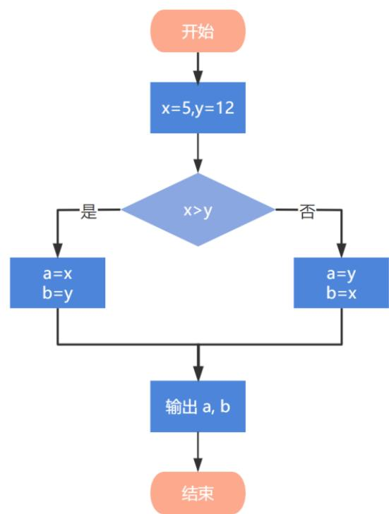

# C++ 二级

2023年9月

## 1 单选题（每题2分，共30分）

<table><tr><td>题号</td><td>1</td><td>2</td><td>3</td><td>4</td><td>5</td><td>6</td><td>7</td><td>8</td><td>9</td><td>10</td><td>11</td><td>12</td><td>13</td><td>14</td><td>15</td></tr><tr><td>答案</td><td>D</td><td>B</td><td>C</td><td>B</td><td>D</td><td>C</td><td>D</td><td>A</td><td>D</td><td>A</td><td>B</td><td>B</td><td>D</td><td>A</td><td>A</td></tr></table>

第 1 题 我国第一台大型通用电子计算机使用的逻辑部件是（）。

A. 集成电路

B. 大规模集成电路

C. 晶体管

D. 电子管

第2题 下列流程图的输出结果是（）？



□ A. 5 12
□ B. 12 5
□ C. 5 5
□ D. 12 12

第3题 如果要找出整数a、b中较大一个，通常要用下面哪种程序结构？（）。  
□A.顺序结构  
□B.循环结构  
□C.分支结构  
□D.跳转结构

第4题 以下不是C++关键字的是（）。  
□A.continue  
□B.cout  
□C.break  
□D.goto

第5题 C++表达式 int(-123.123 / 10) 的值是（）。  
□A.-124  
□B.-123  
□C.-13  
□D.-12

第6题 以下C++代码实现从大到小的顺序输出N的所有因子。例如，输入N = 18时输出1896321，横线处应填入（）。

int N = 0;
cin >> N;
for (\_\_\_\_) // 此处填写代码
    if (!(N % i))
    cout << i << ' ',

□ A. ; ;
□ B. int i = 1; i < N; i++
□ C. int i = N; i > 0; i--
□ D. int i = N; i > 1; i--

第 7 题 如下图所示，输出 N 行 N 列的矩阵，对角线为 1，横线处应填入（）。

```txt
请输入行列数量:9
1 0 0 0 0 0 0 0 0
0 1 0 0 0 0 0 0 0
0 0 1 0 0 0 0 0 0
0 0 0 1 0 0 0 0 0
0 0 0 0 1 0 0 0 0
0 0 0 0 0 1 0 0 0
0 0 0 0 0 0 1 0 0
0 0 0 0 0 0 1 0 0
0 0 0 0 0 0 0 1 0
0 0 0 0 0 0 0 1 0
0 0 0 0 0 0 0 0 1
1 int N = 0;
2 cout << "请输入行列数量:";
3 cin >> N;
4 for (int i = 1; i < N + 1; i++) {
5    for (int j = 1; j < N + 1; j++)
6    if (____) // 此处填写代码
7    cout << 1 << " ";
8    else
9    cout << 0 << " ";
10    cout << endl;
11 }
□ A. i = j
□ B. j != j
□ C. i >= j
□ D. i == j
```

第8题 下面C++代码用于判断 N 是否为质数（素数），约定输入 N 为大于等于2的正整数，请在横线处填入合适的代码（）。

```txt
int N = 0, i = 0;
cout << "请输入一个大于等于2的正整数：";
cin >> N;

for (i = 2; i < N; i++)
    if (N % i == 0) {
    cout << "非质数";
    ____; // 此处填写代码
    }
    if (i == N)
    cout << "是质数";

□ A. break
□ B. continue
□ C. exit
□ D. return
```

```txt
第9题 下面C++代码执行后的输出是（）。  
1 int N = 9;  
2 for (int i = 2; i < N; i++)  
3 if (N % i)  
4 cout << "1#";  
5 cout << "0" << endl;  
□A. 1#0  
□B. 1#  
□C. 1#1#1#1#1#1  
□D. 1#1#1#1#1#1#0
```

第10题 下面 $\mathrm{C}++$ 代码执行后的输出是（）。

```txt
int cnt = 0;
for (int i = 1; i < 9; i++)
    for (int j = 1; j < i; j += 2)
    cnt += 1;
cout << cnt;
□ A. 16
□ B. 28
□ C. 35
□ D. 36
```

第11题 下面 $\mathrm{C}++$ 代码执行后的输出是（）。

```txt
int cnt = 0;
for (int i = 1; i < 13; i += 3)
    for (int j = 1; j < i; j += 2)
    if (i * j % 2 == 0)
    break;
    else
    cnt += 1;
cout << cnt;
□ A. 1
□ B. 3
□ C. 15
□ D. 没有输出
```

第12题 下面 $\mathrm{C}++$ 代码执行后的输出是（）。

```txt
int x = 1;
while (x < 100) {
    if (!(x % 3))
    cout << x << ",";
    else if (x / 10)
    break;
    x += 2;
}
cout << x;

□ A. 1
□ B. 3,9,11
□ C. 3,6,9,10
□ D. 1,5,7,11,13,15
```

第 13 题 下面图形每一行从字母A开始，以ABC方式重复。行数为输入的整数。请在C++代码段横线处填入合适代码（）。

请输入字母行数：7

```txt
请输入字母行数：7
A
AB
ABC
ABCA
ABCAB
ABCABC
ABCABCA

1 int N = 0;
2 cout << "请输入行列数量：";
3 cin >> N;
4 for (int i = 1; i < N + 1; i++) {
5    for (int j = 0; j < i; j++)
6    cout << ____; // 此处填写代码
7    cout << endl;
8 }
□ A. 'A' + j / 3
□ B. (char)('A' + j / 3)
□ C. 'A' + j % 3
□ D. (char)('A' + j % 3)
```

第14题输入行数，约定 $1 \leq lineCount \leq 9$ ，输出以下图形。应在C++代码横线处填入（）。

```txt
输入行数量：9
    1
    1 2 1
    1 2 3 2 1
    1 2 3 4 3 2 1
    1 2 3 4 5 4 3 2 1
    1 2 3 4 5 6 5 4 3 2 1
    1 2 3 4 5 6 7 6 5 4 3 2 1
    1 2 3 4 5 6 7 8 7 6 5 4 3 2 1
    1 2 3 4 5 6 7 8 9 8 7 6 5 4 3 2 1

int lineCount = 0;
cout << "请输入行数量：";
cin >> lineCount;
for (int i = 0; i < lineCount; i++) {
    for (int j = 0; j < ____; j++) // 此处填写代码
    cout << ' ';
    for (int j = 1; j < i + 1; j++)
    cout << j << " ";
    for (int j = i + 1; j > 0; j--)
    cout << j << " ";
    cout << endl;
}
A. (lineCount - i - 1) * 2
B. (lineCount - i) * 2
C. lineCount - i - 1
D. lineCount - i
```

第 15 题 某班级人数不知，连续输入成绩直到输入负数停止，输入结束后求出平均成绩。在以下 C++ 代码横线处应填入是（）。

```txt
double totalScore = 0; // 总分
int studCount = 0; // 总人数
while (____) { // 此处填写代码
    cin >> score;
    if (score < 0)
    break;
    totalScore += score;
    studCount += 1;
}
cout << "平均分=" << totalScore / studCount;

□ A. true
□ B. false
□ C. True
□ D. False
```

## 2 判断题（每题2分，共20分）

<table><tr><td>题号</td><td>1</td><td>2</td><td>3</td><td>4</td><td>5</td><td>6</td><td>7</td><td>8</td><td>9</td><td>10</td></tr><tr><td>答案</td><td>√</td><td>√</td><td>×</td><td>×</td><td>√</td><td>×</td><td>×</td><td>×</td><td>×</td><td>√</td></tr></table>

第 1 题 我们常说的互联网（Internet）是一个覆盖全球的广域网络，它不属于任何一个国家。

第2题 神威·太湖之光超级计算机是中国自主研制的超级计算机，在全球超级计算机TOP500排行榜中多次荣膺榜首。

第3题 C++表达式7.8 / 2的值为3.9，类型为float。

第 4 题 C++ 表达式 (2 \* 3) || (2 + 5) 的值为 67。

第5题如果m和n为int类型变量，则执行for（m = 0, n = 1; n < 9;）n = ((m = 3 \* n, m + 1), m - 1);之后n的值为偶数。

第6题 如果a为int类型的变量，则表达式（a >= 5 && a <= 10）与（5 <= a <= 10）的值总是相同的。

第 7 题 下面 C++ 代码执行后的输出为 10 。

```c
int cnt = 0;
for (int i = 1; i < 10; i++) {
    cnt += 1;
    i += 1;
}
cout << cnt;
```

第8题 执行以下 $\mathrm{C}++$ 代码后的输出为0。

```txt
int rst = 0;
for (int i = -100; i < 100; i += 2)
    rst += i;
cout << rst;
```

第9题 执行以下C++代码后的输出为30。

```c
int rst = 0;
for (int i = 0; i < 10; i += 2)
    rst += i;
cout << rst;
```

第 10 题 C++ 是一种高级程序设计语言。

## 3 编程题（每题25分，共50分）

## 3.1 编程题1

\- 试题编号：2023-09-23-02-C-01

\- 试题名称：小杨的X字矩阵

\- 时间限制： $1.0 \mathrm{~s}$

\- 内存限制：128.0 MB

```txt
1 | 5
```

## 3.1.1 问题描述

小杨想要构造一个 $N \times N$ 的 $X$ 字矩阵（ $N$ 为奇数），这个矩阵的两条对角线都是半角加号 +，其余都是半角减号 -。例如，一个 $5 \times 5$ 的 $X$ 字矩阵如下：

<table><tr><td>1</td><td>+----+</td></tr><tr><td>2</td><td>-+-+-</td></tr><tr><td>3</td><td>--+--</td></tr><tr><td>4</td><td>-+-+-</td></tr><tr><td>5</td><td>+----+</td></tr></table>

请你帮小杨根据给定的 $N$ 打印出对应的“X字矩阵”。

## 3.1.2 输入描述

一行一个整数 $N$ （ $5 \leq N \leq 49$ ，保证 $N$ 为奇数）。

## 3.1.3 输出描述

输出对应的“X 字矩阵”。

请严格按格式要求输出，不要擅自添加任何空格、标点、空行等任何符号。你应该恰好输出 N 行，每行除了换行符外恰好包含 N 个字符，这些字符要么是 +，要么是 -。

## 3.1.4 特别提醒

在常规程序中，输入、输出时提供提示是好习惯。但在本场考试中，由于系统限定，请不要在输入、输出中附带任何提示信息。

## 3.1.5 样例输入1

## 3.1.6 样例输出1

```diff
1 +----+
2 -+-+
3 --+-+
4 -+-+
5 +----+
```

## 3.1.7 样例输入2

```txt
1 | 7
```

## 3.1.8 样例输出2

```txt
1 +----+
2 -+----+
3 --+-+
4 --+-+
5 --+-+
6 -+----+
7 +----+
```

## 3.1.9 参考程序

```cpp
#include <iostream>
using namespace std;

int main() {
    int n = 0;
    cin >> n;
    for (int i = 0; i < n; i++) {
    for (int j = 0; j < n; j++) {
    if (i == j || i + j == n - 1) {
    cout << "+";
    } else {
    cout << "-";
    }
    }
    cout << endl;
    }
    return 0;
}
```

## 3.2 编程题2

\- 试题编号：2023-09-23-02-C-02

\- 试题名称：数字黑洞

\- 时间限制：1.0 s

\- 内存限制：128.0 MB

## 3.2.1 问题描述

给定一个三位数，要求各位不能相同。例如，352是符合要求的，112是不符合要求的。将这个三位数的三个数字重新排列，得到的最大的数，减去得到的最小的数，形成一个新的三位数。对这个新的三位数可以重复上述过程。神奇的是，最终一定会得到495！

试试看，重新排列352，得到的最大数为532，最小数为235，它们的差是297；变换297，得到 $972 - 279 = 693$ ；变换693， $963 - 369 = 594$ ；变换594， $954 - 459 = 495$ 。因此，352经过4次变换得到了495。

现在，输入的三位数，你能通过编程得出，这个三位数经过多少次变换能够得到495吗？

## 3.2.2 输入描述

输入一行，包含一个符合要求的三位数N。

## 3.2.3 输出描述

输出一行，包含一个整数C，表示经过C次变换得到495。

## 3.2.4 样例输入1

## 3.2.5 样例输出1

## 3.2.6 参考程序

```cpp
#include <iostream>
using namespace std;

int main() {
    int n = 0;
    cin >> n;
    for (int t = 0; ; t++) {
    if (n == 495) {
    cout << t << endl;
    break;
    }
    int m0 = n % 10, m1 = n / 10 % 10, m2 = n / 100;
    int tmax = 0, tmin = 0;
    if (m0 >= m1 && m1 >= m2) {
    tmax = m0 * 100 + m1 * 10 + m2;
    tmin = m2 * 100 + m1 * 10 + m0;
    } else if (m0 >= m2 && m2 >= m1) {
    tmax = m0 * 100 + m2 * 10 + m1;
    tmin = m1 * 100 + m2 * 10 + m0;
    } else if (m1 >= m0 && m0 >= m2) {
    tmax = m1 * 100 + m0 * 10 + m2;
    tmin = m2 * 100 + m0 * 10 + m1;
    } else if (m1 >= m2 && m2 >= m0) {
    tmax = m1 * 100 + m2 * 10 + m0;
    tmin = m0 * 100 + m2 * 10 + m1;
    } else if (m2 >= m0 && m0 >= m1) {
    tmax = m2 * 100 + m0 * 10 + m1;
    tmin = m1 * 100 + m0 * 10 + m2;
    } else { // m2 >= m1 && m1 >= m0
    tmax = m2 * 100 + m1 * 10 + m0;
    tmin = m0 * 100 + m1 * 10 + m2;
    }
    n = tmax - tmin;
    }
    return 0;
}
```