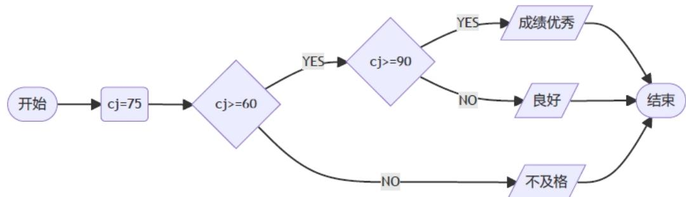

# C++ 二级

2024年03月

1 单选题（每题2分，共30分）

<table><tr><td>题号</td><td>1</td><td>2</td><td>3</td><td>4</td><td>5</td><td>6</td><td>7</td><td>8</td><td>9</td><td>10</td><td>11</td><td>12</td><td>13</td><td>14</td><td>15</td></tr><tr><td>答案</td><td>B</td><td>B</td><td>B</td><td>C</td><td>B</td><td>C</td><td>D</td><td>B</td><td>C</td><td>A</td><td>D</td><td>A</td><td>C</td><td>C</td><td>C</td></tr></table>

第1题 下列流程图的输出结果是？（）



□A.优秀  
□B.良好  
□C.不及格  
□D.没有输出

第2题 以下选项中不符合C++变量命名规则的是？（）
□ A. student
□ B. 2\_from
□ C. \_to
□ D. Text

第3题 以下选项中，不能用于表示分支结构的C++保留字是？（）
□ A. switch
□ B. return
□ C. else
□ D. if

第4题 下列说法错误的是？（）
□ A. while 循环满足循环条件时不断地运行，直到指定的条件不满足为止- B. if 语句通常用于执行条件判断
- C. 在C++中可以使用foreach循环
- D. break和continue语句都可以用在for循环和while循环中

第5题 下列4个表达式中，答案不是整数8的是？（）
□ A. abs(-8)
□ B. min(max(8, 9), 10)
□ C. int(8.88)
□ D. sqrt(64)

第6题 下面 $\mathrm{C}++$ 代码执行后的输出是？（）

```c
int n, a, m, i;
n=3, a = 5;
m = (a - 1) * 2;
for (i=0; i<n-1; i++)
    m = (m - 1) * 2;
cout << m;
```

□A.8   
□B.14   
□C.26   
□D.50

第7题 下面 $\mathrm{C}++$ 代码执行后的输出是？（）

```txt
int n,i,result;
n = 81;
i = 1, result = 1;
while (i * i <= n){
    if (n % (i * i) == 0)
    result = i * i;
    i += 1;
}
cout << result;
```

□A.16   
□B.36   
□C.49   
□D.81

第8题 下面 $\mathrm{C}++$ 代码执行后的输出是？（）

```txt
int s,t,ans;
s = 2, t = 10;
ans = 0;
while (s != t){
    if (t % 2 == 0 && t / 2 >= s)
    t /= 2;
    else 
    t -= 1;
    ans += 1;
}
cout << ans;
```

```txt
□A.2   
□B.3   
□C.4   
□D.5
```

第9题 下面 $\mathrm{C}++$ 代码执行后的输出是？（）

```c
int n, masks, days, cur;
n = 17, masks = 10, days = 0;
cur = 2;
while (masks != n){
    if (cur == 0 || cur == 1)
    masks += 7;
    masks -= 1;
    days += 1;
    cur = (cur + 1) % 7;
}
cout << days;
```

```txt
□A.5   
□B.6   
□C.7   
□D.8
```

第 10 题 以下 C++ 代码判断一个正整数 N 的各个数位是否都是偶数。如果都是，则输出“是”，否则输出“否”。例如 N=2024 时输出“是”。则横线处应填入（）。

```txt
int N,Flag;
cin >> N;
Flag = true;
while (N != 0){
    if (N %2 != 0){
    Flag = false;
    }
    else
    N /= 10;
```

```txt
11 }  
12 if(Flag == true)  
13 cout << "是";  
14 else  
15 cout << "否";
```

```txt
□ A. break
□ B. continue
□ C. N = N / 10
□ D. N = N % 10
```

第 11 题 有句俗话叫“三天打渔，两天晒网”。如果小杨前三天打渔，后两天晒网，一直重复这个过程，以下程序代码用于判断，第n天小杨是在打鱼还是晒网，横线处应填写？（）

```txt
int n,i;
cin >> n;
i = n % 5;
if (____) // 在此处填写代码
    cout << "晒网";
else
    cout << "打鱼";
```

```txt
□ A. i == 0
□ B. i == 4
□ C. i == 0 && i == 4
□ D. i == 0 || i == 4
```

第 12 题 一个数的所有数字倒序排列后这个数的大小保持不变，这个数就是回文数，比如 101 与 6886 都是回文数，而 100 不是回文数。以下程序代码用于判断一个数是否为回文数，横线处应填写？（）

```txt
int n, a, k;
cin >> n;
a = 0;
k = n;
while (n > 0){
    a = ____; // 在此处填写代码
    n /= 10;
}
if (a == k)
    cout << "是回文数";
else
    cout << "不是回文数";
```

<div class="mineru-algorithm" style="white-space: pre-wrap; font-family:monospace;">
□A. $10 * a + n\% 10$ □B. $a + n\% 10$ □C. $10 * a + n / 10$ □D. $a + n / 10$
</div>

第13题 给定两个整数 $n$ 与 $k$ ，打印出一个栅栏图形，这个栅栏应该分成 $n$ 段，段与段之间的间隔为 $+$ ，段内的填充为 $k$ 个 $-$ 。形如 $n = 5$ ， $k = 6$ 时，图形如下：

```txt
1 | +---+---+---+---+---+---+
```

以下程序代码用于绘制该图形，横线处应填写？（）

```c
int n, k, i, j;
n = 5, k = 6;
for (i = 0; i < n; i++) {
    // 在此处填写代码
    for (j = 1; j < k; j++)
    cout << '-' ;
}
cout << '+';
```

```txt
□ A. cout << '+' << endl;
□ B. cout << '+' << ' ' << endl;
□ C. cout << '+';
□ D. cout << '+' << ' ';
```

第14题 小杨的父母最近刚刚给他买了一块华为手表，他说手表上跑的是鸿蒙，这个鸿蒙是。（）
□ A. 小程序
□ B. 计时器
□ C. 操作系统
□ D. 神话人物

第 15 题 中国计算机学会（CCF）在2024年1月27日的颁奖典礼上颁布了王选奖，王选先生的重大贡献是（）。  
□ A. 制造自动驾驶汽车  
□ B. 创立培训学校  
□ C. 发明汉字激光照排系统  
□ D. 成立方正公司

## 2 判断题（每题 2 分，共 20 分）

<table><tr><td>题号</td><td>1</td><td>2</td><td>3</td><td>4</td><td>5</td><td>6</td><td>7</td><td>8</td><td>9</td><td>10</td></tr><tr><td>答案</td><td>×</td><td>√</td><td>×</td><td>×</td><td>×</td><td>√</td><td>×</td><td>×</td><td>√</td><td>√</td></tr></table>

第1题 如果有以下C++代码:

```matlab
1 double s;
2 int t;
3 s = 18.5;
4 t = int(s) + 10;
```

那么 cout << t 的结果为 28.5。

第 2 题 Xyz，xYz，xyZ 是三个不同的变量。

第 3 题 cout << (8 < 9 < 10) 的输出结果为 true。

第 4 题 for (i = 0; i < 100; i += 2)；语句中变量i的取值范围是0到99。

第 5 题 C++ 中 cout << float(2022) 与 cout << float('2022') 运行后的输出结果均为 2022。

第6题 已知A的ASCII码值为65，表达式int('C')+abs(-5.8)的值为72.8。

第 7 题 bool() 函数用于将给定参数或表达式转换为布尔类型。语句 bool(-1) 返回的是 false 值。（）

第 8 题 如果变量 a 的值使得 C++ 表达式 sqrt(a)==abs(a)，则 a 的值为 0。（）

第 9 题 小杨今年春节回奶奶家了，奶奶家的数字电视要设置ip地址并接入到WIFI盒子才能收看节目，那这个WIFI盒子具有路由器的功能。（）

第 10 题 任何一个 for 循环都可以转化为等价的 while 循环（）。

## 3 编程题（每题25分，共50分）

## 3.1 编程题1

\- 试题名称：乘法问题

## 3.1.1 问题描述

小 A 最近刚刚学习了乘法，为了帮助他练习，我们给他若干个正整数，并要求他将这些数乘起来。

对于大部分题目，小 A 可以精准地算出答案，不过，如果这些数的乘积超过 $10^{6}$ ，小 A 就不会做了。

请你写一个程序，告诉我们小 A 会如何作答。

## 3.1.2 输入描述

第一行一个整数 n，表示正整数的个数。

接下来 n 行，每行一个整数 a。小 A 需要将所有的 a 乘起来。

保证 $n \leq 50,\ a \leq 100$ 。

## 3.1.3 输出描述

输出一行，如果乘积超过 $10^{6}$ ，则输出 >1000000；否则输出所有数的乘积。

## 3.1.4 特别提醒

在常规程序中，输入、输出时提供提示是好习惯。但在本场考试中，由于系统限定，请不要在输入、输出中附带任何提示信息。

## 3.1.5 样例输入1

## 3.1.6 样例输出1

```txt
1 | 15
```

## 3.1.7 样例输入2

```csv
1 3
2 100
3 100
4 100
```

## 3.1.8 样例输出2

```txt
1 | 1000000
```

## 3.1.9 样例输入3

```csv
1 4
2 100
3 100
4 100
5 2
```

## 3.1.10 样例输出2

```txt
1 | >1000000
```

## 3.1.11 参考程序

```cpp
#include <iostream>
using namespace std;

int main() {
    int n;
    cin >> n;

    long long product = 1;
    for (int i = 0; i < n; ++i) {
    int a;
    cin >> a;
    if (product * a > 1000000) {
    cout << ">1000000" << endl;
    return 0;
    }
    product *= a;
    }

    cout << product << endl;

    return 0;
}
```

```txt
1 | 7
```

## 3.2 编程题2

\- 试题名称：小杨的日字矩阵

## 3.2.1 问题描述

小杨想要构造一个 $N \times N$ 的日字矩阵（ $N$ 为奇数），具体来说，这个矩阵共有 $N$ 行，每行 $N$ 个字符，其中最左列、最右列都是 |，而第一行、最后一行、以及中间一行（即第 $\frac{N+1}{2}$ 行）的第 $2 \sim N-1$ 个字符都是 -，其余所有字符都是半角小写字母 $\mathbf{x}$ 。例如，一个 $N=5$ 的日字矩阵如下：

<table><tr><td>1</td><td>|---|</td></tr><tr><td>2</td><td>|xxx|</td></tr><tr><td>3</td><td>|---|</td></tr><tr><td>4</td><td>|xxx|</td></tr><tr><td>5</td><td>|---|</td></tr></table>

请你帮小杨根据给定的 N 打印出对应的“日字矩阵”。

## 3.2.2 输入描述

一行一个整数 $N$ （ $5 \leq N \leq 49$ ，保证 $N$ 为奇数）。

## 3.2.3 输出描述

输出对应的“日字矩阵”。

请严格按格式要求输出，不要擅自添加任何空格、标点、空行等任何符号。你应该恰好输出 N 行，每行除了换行符外恰好包含 N 个字符，这些字符要么是 -，要么是 |，要么是 x。你的输出必须和标准答案完全一致才能得分，请在提交前仔细检查。

## 3.2.4 特别提醒

在常规程序中，输入、输出时提供提示是好习惯。但在本场考试中，由于系统限定，请不要在输入、输出中附带任何提示信息。

## 3.2.5 样例输入1

```txt
1 | 5
```

## 3.2.6 样例输出1

<table><tr><td>1</td><td>|---|</td></tr><tr><td>2</td><td>|xxx|</td></tr><tr><td>3</td><td>|---|</td></tr><tr><td>4</td><td>|xxx|</td></tr><tr><td>5</td><td>|---|</td></tr></table>

## 3.2.7 样例输入2

## 3.2.8 样例输出2

```markdown
1 | ---- |
2 |xxxxx |
3 |xxxxx |
4 |---- |
5 |xxxxx |
6 |xxxxx |
7 |----
```

## 3.2.9 参考程序

```cpp
#include <iostream>
using namespace std;

int main() {
    int n;
    cin >> n;

    for (int i = 0; i < n; ++i) {
    for (int j = 0; j < n; ++j) {
    char ch;
    if (j == 0 || j == n - 1) {
    ch = '|';
    } else if (i == 0 || i == n - 1 || i == n / 2) {
    ch = '-';
    } else {
    ch = 'x';
    }
    cout << ch;
    }
    cout << endl;
    }

    return 0;
}
```