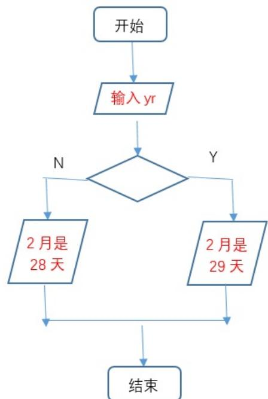

# C++ 二级

2024 年 06 月

## 1 单选题（每题 2 分，共 30 分）

<table><tr><td>题号</td><td>1</td><td>2</td><td>3</td><td>4</td><td>5</td><td>6</td><td>7</td><td>8</td><td>9</td><td>10</td><td>11</td><td>12</td><td>13</td><td>14</td><td>15</td></tr><tr><td>答案</td><td>C</td><td>B</td><td>A</td><td>A</td><td>A</td><td>C</td><td>D</td><td>B</td><td>C</td><td>C</td><td>D</td><td>D</td><td>A</td><td>B</td><td>D</td></tr></table>

第1题 小杨父母带他到某培训机构给他报名参加CCF组织的GESP认证考试的第1级，那他可以选择的认证语言有几种？（ ）A. 1B. 2C. 3D. 4

第2题 下面流程图在yr输入2024时，可以判定yr代表闰年，并输出 2月是29天 ，则图中菱形框中应该填入（ ）。



A. (yr%400==0) || (yr%4==0)

B. (yr%400==0) || (yr%4==0 && yr%100!=0)

C. (yr%400==0) && (yr%4==0)

D. (yr%400==0) && (yr%4==0 && yr%100!=0)

第3题 在C++中，下列不可做变量的是( )。

A. five-Star B. five\_star C. fiveStar D. \_fiveStar

第 4 题 在C++中，与 for(int i=0; i<10; i++) 效果相同的是( )。A. for(int i=0; i<10; i+=1)B. for(int i=1; i<=10; i++)C. for(int i=10; i>0; i--)D. for(int i=10; i<1; i++)

第 5 题 在C++中， cout << (5 % 2 && 5 % 3) 的输出是( )。A. 1B. 2C. trueD. false

第 6 题 6.执行下面的C++代码时输入 1 ，则输出是( )。

```cpp
int month;
cin >> month;
switch(month){
    case 1:
    cout << "Jan ";
    case 3:
    cout << "Mar ";
    break;
    default:
    ;
}
```

A. JanB. MarC. Jan MarD. 以上均不对

第7题 执行下面C++代码后，有关说法错误的是（ ）。

```txt
int a, b;
cin >> a >> b;
if (a && b)
    cout << "1";
else if (!(a || b))
    cout << "2";
else if (a || b)
    cout << "3";
else
    cout << "4";
```

A. 如果先后输入1和1，则将输出1

B. 如果先后输入0和1或者1和0，则将输出3

C. 如果先后输入0和0，则将输出2

D. 如果先后输入0和0，则将输出4

第8题 某货币由5元，2元和1元组成。输入金额（假设为正整数），计算出最少数量。为实现其功能，横线处应填入代码是（ ）。

```perl
int N;
cin >>N;

int M5, M2, M1;
M5 = N / 5;
M2 = ____;
M1 = ____;
printf("5*%d+2*%d+1*%d", M5, M2, M1);
```

A. 第1横线处应填入：N / 2

第2横线处应填入：N - M5 - M2

B. 第1横线处应填入：(N - M5 \* 5) / 2

C. 第1横线处应填入：N - M5 \* 5 / 2

第9题 下面C++代码执行后的输出是（ ）。

```txt
int loopCount = 0;
for (int i=0; i < 10; i++)
    for (int j=1; j < i; j++)
    loopCount += 1;
cout << loopCount;
```

A. 55

```csv
□ B. 45
□ C. 36
□ D. 28
```

第 10 题 下面C++代码执行后的输出是（ ）。

```txt
int loopCount = 0;
for (int i=0; i < 10; i++) {
    for (int j=0; j < i; j++)
    if (i * j % 2)
    break;
    loopCount += 1;
}
cout << loopCount;
```

```txt
□A.25   
□B.16   
□C.10   
□D.9
```

第11题 假设下面C++代码执行过程中仅输入正负整数或0，有关说法错误的是（ ）。

```txt
int N, Sum = 0;
cin >> N;
while (N){
    Sum += N;
    cin >> N;
}
cout << Sum;
```

<div class="mineru-algorithm" style="white-space: pre-wrap; font-family:monospace;">
□A.执行上面代码如果输入0，将终止循环  
□B.执行上面代码能实现所有非0整数的求和  
□C.执行上面代码第一次输入0，最后将输出0  
□D.执行上面代码将陷入死循环，可将while(N)改为while $(N = = 0)$
</div>

第12题 执行下面的C++代码，有关说法正确的是（ ）【质数是指仅能被1和它本身整除的正整数】。

```txt
int N;
cin >> N;
bool Flag = true;
for ( int i = 2; i < N; i++) {
    if (i * i > N)
    break;
    if (N % i == 0) {
    Flag = false;
    break;
    }
}
if (Flag)
```

```txt
13    cout << N << "是质数" << endl;
14 else
15    cout << N << "不是质数" << endl;
```

A. 如果输入正整数，上面代码能正确判断N是否为质数B. 如果输入整数，上面代码能正确判断N是否为质数C. 如果输入大于等于0的整数，上面代码能正确判断N是否质数D. 如将 Flag = true 修改为 Flag = N>=2? true:false 则能判断所有整数包括负整数、0、正整数是否为质数

第13题 下面C++代码用于实现如下图所示的效果，其有关说法正确的是（ ）。

```csv
1
2 4
3 6 9
4 8 12 16
5 10 15 20 25
```

```txt
for (int i = 1; i < 6; i++) { // L1
    for (int j = 1; j < i + 1; j++) // L2
    cout << i * j << " ";
    cout << endl;
}
```

A. 当前代码能实现预期效果，无需调整代码B. 如果 cout << endl; 移到循环L2内部，则可实现预期效果C. 如果 cout << endl; 移到循环L1外部，则可实现预期效果D. 删除 cout << endl; 行，则可实现预期效果

第 14 题 下面C++代码执行后，输出是（ ）。

```c
int cnt1 = 0, cnt2 = 0;
for (int i = 0; i < 10; i++) {
    if (i % 2 == 0)
    continue;
    if (i % 2)
    cnt1 += 1;
    else if (i % 3 == 0)
    cnt2 += 1;
}
cout << cnt1 << " " << cnt2;
```

第15题 在下面的C++代码中，N必须是小于10大于1的整数，M为正整数（大于0）。如果M被N整除则M为幸运数，如果M中含有N且能被N整除，则为超级幸运数，否则不是幸运数。程序用于判断M是否为幸运数或超级幸运数或非幸运数。阅读下面代码，有关说法正确的是（ ）。

```txt
int N, M;
cout << "请输入幸运数字：";
cin >> N;
cout << "请输入正整数：";
cin >> M;

bool Lucky;
if (M % N == 0)
    Lucky = true;
else
    Lucky = false;
while (M){
    if (M % 10 == N && Lucky){
    printf("%d是%d的超级幸运数！", M, N);
    break;
    }
    M /= 10;
}
if (M == 0)
    if (Lucky)
    printf("%d是%d的幸运数！", M, N);
    else
    printf("%d非%d的幸运数！", M, N);
```

A. 如果N输入3，M输入36则将输出：36是3的超级幸运数!B. 如果N输入7，M输入21则将输出：21是7的幸运数!C. 如果N输入8，M输入36则将输出：36非8的超级幸运数!D. 如果N输入3，M输入63则将输出：63是3的超级幸运数!

## 2 判断题（每题 2 分，共 20 分）

<table><tr><td>题号</td><td>1</td><td>2</td><td>3</td><td>4</td><td>5</td><td>6</td><td>7</td><td>8</td><td>9</td><td>10</td></tr><tr><td>答案</td><td>×</td><td>×</td><td>×</td><td>√</td><td>×</td><td>×</td><td>×</td><td>√</td><td>√</td><td>√</td></tr></table>

第 1 题 执行C++代码 cout << '9'+'1'; 的输出为10。( )第 2 题 C++表达式 -12 % 10 的值为2。( )第 3 题 C++表达式 int(12.56) 的值为13。（ ）第 4 题 C++的整型变量N被赋值为10，则语句 cout << N / 3 << "-" << N % 3 执行后输出是3-1。 ( )第5题 在C++代码中，不可以将变量命名为scanf，因为scanf是C++语言的关键字。（ ）第6题 下面C++代码执行后将导致死循环。（ ）

```txt
1 for (int i = 0; i < 10; i++)
2 continue;
```

第7题 下面C++代码执行后将输出10。（ ）

```c
int cnt = 0;
for (int i = 0; i < 10; i++)
    for (int j = 0; j < i; j++) {
    cnt += 1;
    break;
}
cout << cnt;
```

第 8 题 下面C++代码执行后，将输出5。（ ）

```txt
int cnt = 0;
for (int i = 1; i < 5; i++)
    for (int j = i; j < 5; j += i)
    if (i * j % 2 == 0)
    cnt += 1;
cout << cnt;
```

第9题 下面C++代码能实现正整数各位数字之和。（ ）

```c
int N, Sum = 0;
cin >> N;
while (N){
    Sum += N % 10;
    N /= 10;
}
cout << Sum;
```

第10题 GESP测试是对认证者的编程能力进行等级认证，同一级别的能力基本上与编程语言无关。（ ）

## 3 编程题（每题 25 分，共 50 分）

## 3.1 编程题 1

试题名称：平方之和

时间限制：1.0 s

内存限制：512.0 MB

## 3.1.1 题面描述

小杨有 个正整数 $a _ { 1 } , a _ { 2 } , \ldots , a _ { n }$ ，他想知道对于所有的 $i \left( 1 \leq i \leq n \right)$ ，是否存在两个正整数 和 满足$x \times x + y \times y = a _ { i } { \mathrm { _ { c } } }$

## 3.1.2 输入格式

第一行包含一个正整数 ，代表正整数数量。

之后 行，每行包含一个正整数，代表 $a _ { i } .$ 。

## 3.1.3 输出格式

对于每个正整数 ，如果存在两个正整数 和 满足 $x \times x + y \times y = a _ { i }$ ，输出Yes，否则输出No。

## 3.1.4 样例1

```txt
1 | 2
2 | 5
3 | 4

1 | Yes
2 | No
```

## 3.1.5 样例解释

对于第一个正整数，存在 ，因此答案为 Yes。

## 3.1.6 数据范围

对于全部数据，保证有 $1 \leq n \leq 1 0 , 1 \leq a _ { i } \leq 1 0 ^ { 6 } ,$ 5

## 3.1.7 参考程序

```txt
#include<bits/stdc++.h>
using namespace std;
bool check(int x){
    int y = sqrt(x);
    return y*y==x;
}
int main(){
    int t;
    cin>>t;
    while(t--){
    int n;
    cin>>n;
    int fl=0;
    for(int i=1;i*i<n;i++){
    int j=n-i*i;
    if(check(j))fl=1;
    }
    if(fl)cout<<"Yes\n";
    else cout<<"No\n";
    }
}
```

## 3.2 编程题 2

试题名称：计数

时间限制：1.0s

内存限制：512.0 MB

```txt
1 | 25
2 | 2
1 | 9
```

## 3.2.1 题面描述

小杨认为自己的幸运数是正整数 （注：保证 ）。小杨想知道，对于从 到 的所有正整数中， 出现了多少次。

## 3.2.2 输入格式

第一行包含一个正整数 。

第二行包含一个正整数 。

## 3.2.3 输出格式

输出从 到 的所有正整数中， 出现的次数。

## 3.2.4 样例1

## 3.2.5 样例解释

从 到 中， 出现的正整数有 ，一共出现了 次。

## 3.2.6 数据范围

对于全部数据，保证有 。

## 3.2.7 参考程序

```cpp
#include <iostream>
using namespace std;

int check(int x, int y) {
    int cnt = 0;
    while (x > 0) {
    int tmp = x % 10;
    if (tmp == y) {
    cnt++;
    }
    x = x / 10;
    }
    return cnt;
}

int main() {
    int n, k;
    cin >> n >> k;
    int ans = 0;
    for (int i = 1; i <= n; i++) {
    ans += check(i, k);
    }
    cout << ans << endl;
    return 0;
}
```